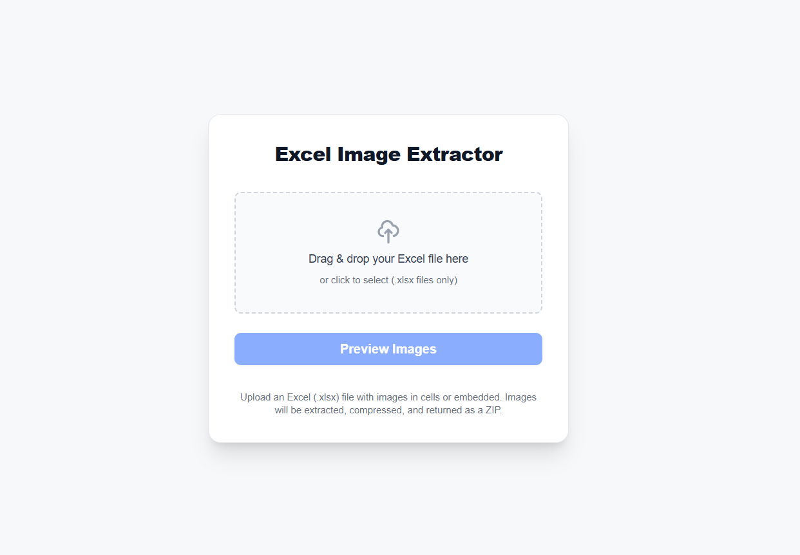

# Excel Image Extractor

A Next.js web application that extracts images from Excel (.xlsx) files and packages them into a downloadable ZIP archive.

## Features

- Upload Excel (.xlsx) files via drag & drop or file picker
- Extract embedded images and images in cells
- Preview extracted images before download
- Rename images before downloading
- Compress and download images as a ZIP file
- Responsive design with modern UI

## Getting Started

First, install dependencies:

```bash
npm install
```

Then, run the development server:

```bash
npm run dev
```

Open [http://localhost:3000](http://localhost:3000) with your browser to see the result.

## How to Use

1. **Upload**: Drag and drop an Excel file or click to select one
2. **Preview**: Click "Preview Images" to extract and view images
3. **Rename** (optional): Edit image names in the preview
4. **Download**: Click "Download ZIP" to get your images

## Demo

### Upload Interface


_Drag & drop or click to upload Excel files_

## Tech Stack

- **Framework**: Next.js 15 with React 19
- **Language**: TypeScript
- **Styling**: Tailwind CSS
- **Testing**: Jest + React Testing Library
- **Image Processing**: Sharp
- **Excel Processing**: ExcelJS
- **File Compression**: JSZip

## Scripts

```bash
npm run dev          # Start development server
npm run build        # Build for production
npm run start        # Start production server
npm run lint         # Run ESLint
npm run test         # Run tests
npm run test:watch   # Run tests in watch mode
```
